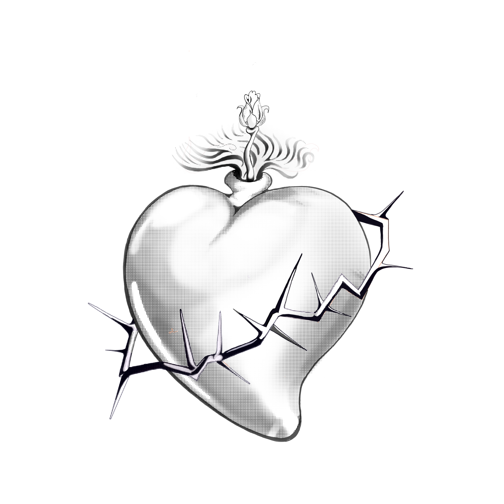

<a href="helloagain.html" style="
  display: inline-block;
  padding: 12px 24px;
  background-color: #405989;
  color: white;
  text-decoration: none;
  border-radius: 6px;
  font-weight: bold;
  font-size: 16px;
  transition: background-color 0.3s;
  border: 2px solid #121f38;
">Go to Second Page</a>

 *This is a Website*  

